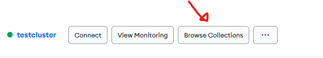

# Utilisation de bases de données document
Pour faire l'exercice plus bas, vous avez le choix entre utiliser MongoDB via AtlasDB ou utiliser TinyDB.

## Se créer un compte gratuit AtlasDB
1) [Enregistrement AtlasDB](https://www.mongodb.com/fr-fr/cloud/atlas/register)
2) Choisir le tier gratuit (shared)
   1) Le nom du cluster (grappe) est à votre choix
3) Sous "Security->Quickstart", créer un user/pwd (ne pas oublier de copier le mot de passe)
4) Sous "Security->Network Access", utiliser le bouton pour ajouter son adresse ip
   1) Le serveur accepte seulement les connexions des adresses ip listées
5) Sous "Deployment->Database", cliquer "Browse Collections"  

6) Sous "Deployment->Database", cliquer "connect" et choisir Python, vous aller pouvoir copier la chaîne de connexion (connexion string)
  1) Il vous restera seulement à remplacer le mot de passe dans la chaîne
7) "Create database", créer une base de donnée "GestionMusique"
8) Créer une collection "Albums"
9) Regarder le code d'exemple pour se connecter avec pymongo

## Créer une application Pyside6 permettant de gérer des albums de musique
1) Créer une application qui va gérer une collection d'albums de musique
   1) Implémenter un CRUD pour les albums
   2) Modéliser le document à votre guise, il doit comprendre un sous-document
   3) Porter une attention particulière aux critères de recherche
   4) Essayer de chercher un document en utilisant un filtre sur un sous-document